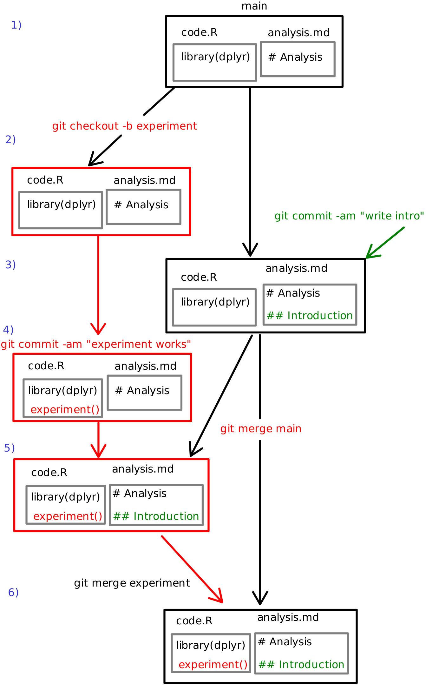

# Git Branches {#git-branches}

While `git` is great for uploading and downloading code, its true
benefits are its ability to support _reversability_ (e.g., undo) and
_collaboration_ (working with other people).  We already discussed how
to get back to the past using git in Chapter [Git and
Github](#git-commit-history-git-time-machine).  But in order to effectively utilize these capabilities, you need to understand git's **branching model**, which is central to how the program manages different versions of code.

This chapter will cover how to work with **branches** with git and GitHub, including using them to work on different features simultaneously and to undo previous changes.
<!-- It will also discuss how to use branches to support different _collaborative workflows_, allowing multiple people to work on code in the same repository. -->


## Git Branches
So far, you've been using git to create a _linear sequence_ of commits: they are all in a line, one after another).

```{r results='asis', echo=FALSE, include=identical(knitr:::pandoc_to(), 'html')}
cat('')
```

Each commit has a message associated with it (that you can see with `git log`), as well as a unique [SHA-1](https://en.wikipedia.org/wiki/SHA-1) hash (the random numbers and letters), which can be used to identify that commit as an "id number".

But you can also save commits in a _non-linear_ sequence. Perhaps you
want to try something new and crazy without breaking code that you've
already written. Or you want to work on two different features
simultaneously (having separate commits for each). Or you want
multiple people to work on the same code without stepping on each
other's toes.  In the world without version control you would make
another copy of your code and perform the edits there.  If your
experiment turns out not to lead anywhere then you can just delete the
copy.  But what if it works well?  If no-one has worked with the
"main" copy of the code then it is not a big deal either--you can just
replace the main copy with your experiment.  But in case of a large
software project it is hardly the case--your collaborators continue
writing text and adding code to the main copy.  Your experiment is now
outdated because _it does not contain those edits_!  You have to re-do
your experiment in the fresh copy of your project over the weekend
again and hope that no-one will change anything meanwhile.

### What are branches

This is where  **git branches** (because you can have commits that
"branch off" from a line of development) come in super useful.  The
idea with branches is as follows.  Instead of just creating a copy,
you create a new _branch_ for your experiment.  Branches are in many
ways like copies, but there are some important differences, in
particular they are tracked by git, and git also facilitates
information exchange (_merging_) between the branches.

<div class="clearfix">
<figure>

<caption>
</caption>
Branches
</figure>
Consider the figure.  Imagine you and Tian are working together on a
report.  You get a great idea that you want to experiment with but you
know that Tian will continue working on the analysis too.

1. Initially the project only has _main_ branch that contains two
   files: _code.R_ and _analysis.md_.  The _main_ branch is colored
   black. 
2. After you got the idea, you create a new branch called _experiment_
  (denoted red on the figure).
  You use `git checkout -b experiment` to create it.  It will be
  essentially a copy of the original main branch.  _experiment_-branch
  and operations there are colored red.
3. Meanwhile, Tian writes introduction to the report and commits the
  changes to the main branch.  Tian's edits are marked in green.
4. Now you create your experimental code and find it works very well.
  You commit your new code.
  At this stage there are two branches in the repo, each of which
  contains information that the other branch does not have.  This is
  exactly the dreaded situation we described above.
5. Fortunately git has tools to "merge" changes from the other branch
  into your branch.  You can get all new things (more precisely, _new
  commits_) from the main branch into your branch with `git merge
  main`.  Now your red experimental branch also contains the new
  introduction that Tian wrote at 3.
6. Finally, when you are happy with your experiment, you can merge the
  results back to main with `git merge experiment`.  All your
  experiment's code is now in the main, and you may delete your
  experiment branch if you wish.
  
Note how `git merge` propagates the green "Introduction" to the red
experiment-branch, and the following git merge propagates the red
"experiment()" code to the main branch.
<div>

While the general idea of branches is not hard, there are many details
your should be aware of.

First, while the repo can have a large number of branches, there is
currently just **one branch that is "active"** in your working copy.
This means when you switch from one branch to another, git will change
the files, potentially adding and deleting those that are present only
in one branch!

Second, merging works in a way that your merge **another branch into
the current branch**.  Hence merging the main branch into experiment
with `git merge main` must be issued while _experiment_ branch is
active (this is why it is written in red), and merging the
_experiment_ branch into _main_ branch with `git merge experiment`
must be issued while the _main_ branch is active (this is why it is
written black).

Third, as switching branches involves changing files, you **cannot
switch branches if you have un-committed changes**.  You have to
commit your edits before you switch, otherwise git cannot keep track
on those.  (But you don't have to push.)


### Creating branches and switching between branches


You can view a list of current branches in the repo with the command
```bash
git branch
```
(The highlighted item with the asterisk (`*`) is the "current branch"
you're on. The latest commit of the branch you're on is referred to as
the **`HEAD`**.) 

You can use the same command to create a _new_ branch:

```bash
git branch [branch_name]
```

This will create a new branch called `branch_name` (replacing `[branch_name]`, including the brackets, with whatever name you want). Note that if you run `git branch` again you'll see that this _hasn't actually changed what branch you're on_. In fact, all you've done is created a new _reference_ (like a new variable!) that refers to the current commit as the given branch name.

- You can think of this like creating a new variable called `branch_name` and assigning the latest commit to that! Almost like you wrote `new_branch <- my_last_commit`.

- If you're familiar with [LinkedLists](https://en.wikipedia.org/wiki/Linked_list), it's a similar idea to changing a pointer in those.

In order to switch to a different branch, use the command (without the brackets)

```bash
git checkout [branch_name]
```

**Checking out** a branch doesn't actually create a new commit! All it does is change the `HEAD` (the "commit I'm currently looking at") so that it now refers to the latest commit of the target branch. You can confirm that the branch has changed with `git branch`.

- You can think of this like assigning a new value (the latest commit of the target branch) to the `HEAD` variable. Almost like you wrote `HEAD <- branch_name_last_commit`.

- Note that you can create _and_ checkout a branch in a single step using the `-b` option of `git checkout`:

    ```bash
    git checkout -b [branch_name]
    ```

Once you've checked out a particular branch, any _new_ commits from that point on will be "attached" to the "HEAD" of that branch, while the "HEAD" of other branches (e.g., `master`) will stay the same. If you use `git checkout` again, you can switch back to the other branch.

- **Important** checking out a branch will "reset" your code to whatever it looked like when you made that commit. Switch back and forth between branches and watch your code change!

```{r results='asis', echo=FALSE, include=identical(knitr:::pandoc_to(), 'html')}
cat('')
```

Note that you can only check out code if the _current working directory_ has no uncommitted changes. This means you'll need to `commit` any changes to the current branch before you `checkout` another. If you want to "save" your changes but don't want to commit to them, you can also use git's ability to temporarily [stash](https://git-scm.com/book/en/v2/Git-Tools-Stashing-and-Cleaning) changes.

Finally, you can delete a branch using `git branch -d [branch_name]`. Note that this will give you a warning if you might lose work; be sure and read the output message!


## Merging
If you have changes (commits) spread across multiple branches, eventually you'll want to combine those changes back into a single branch. This is a process called **merging**: you "merge" the changes from one branch _into_ another. You do this with the (surprise!) `merge` command:

```bash
git merge [other_branch]
```

This command will merge `other_branch` **into the current branch**. So if you want to end up with the "combined" version of your commits on a particular branch, you'll need to switch to (`checkout`) that branch before you run the merge.

- **IMPORTANT** If something goes wrong, don't panic and try to close your command-line! Come back to this book and look up how to fix the problem you've encountered (e.g., how to exit  _vim_). And if you're unsure why something isn't working with git, use **`git status`** to check the current status and for what steps to do next.

- Note that the `rebase` command will perform a similar operation, but without creating a new "merge" commit&mdash;it simply takes the commits from one branch and attaches them to the end of the other. This effectively **changes history**, since it is no longer clear where the branching occurred. From an archival and academic view, you never want to "destroy history" and lose a record of changes that were made. History is important: don't screw with it! Thus we recommend you _avoid_ rebasing and stick with merging.


### Merge Conflicts
Merging is a regular occurrence when working with branches. But consider the following situation:

1. You're on the `master` branch.
2. You create and `checkout` a new branch called `danger`
3. On the `danger` branch, you change line 12 of the code to be "I like kitties". You then commit this change (with message "Change line 12 of danger").
4. You `checkout` (switch to) the `master` branch again.
5. On the `master` branch, you change to line 12 of the code to be "I like puppies". You then commit this change (with message "Change line 12 of master").
6. You use `git merge danger` to merge the `danger` branch **into** the `master` branch.

In this situation, you are trying to _merge two different changes to the same line of code_, and thus should be shown an error on the command-line:


This is called a **merge conflict**. A merge conflict occurs when two commits from different branches include different changes to the same code (they conflict). Git is just a simple computer program, and has no way of knowing which version to keep ("Are kitties better than puppies? How should I know?!").

Since git can't determine which version of the code to keep, it ___stops the merge in the middle___ and forces you to choose what code is correct **manually**.

In order to **resolve the merge conflict**, you will need to edit the file (code) so that you pick which version to keep. Git adds "code" to the file to indicate where you need to make a decision about which code is better:


In order to resolve the conflict:

1. Use `git status` to see which files have merge conflicts. Note that files may have more than one conflict!

2. Choose which version of the code to keep (or keep a combination, or replace it with something new entirely!) You do this by **editing the file** (i.e., open it in Atom or RStudio and change it). Pretend that your cat walked across your keyboard and added a bunch of extra junk; it is now your task to fix your work and restore it to a clean, working state. ___Be sure and test your changes to make sure things work!___

3. Be sure and remove the `<<<<<<<` and `=======` and `>>>>>>>`. These are not legal code in any language.

4. Once you're satisfied that the conflicts are all resolved and everything works as it should, follow the instructions in the error message and `add` and `commit` your changes (the code you "modified" to resolve the conflict):

    ```bash
    git add .
    git commit "Resolve merge conflict"
    ```

    This will complete the merge! Use `git status` to check that everything is clean again.

**Merge conflicts are expected**. You didn't do something wrong if one occurs! Don't worry about getting merge conflicts or try to avoid them: just resolve the conflict, fix the "bug" that has appeared, and move on with your life.

## Undoing Changes
One of the key benefits of version control systems is **reversibility**: the ability to "undo" a mistake (and we all make lots of mistakes when programming!) Git provides two basic ways that you can go back and fix a mistake you've made previously:

1. You can replace a file (or the entire project directory!) with a version saved as a previous commit.

2. You can have git "reverse" the changes that you made with a previous commit, effectively applying the _opposite_ changes and thereby undoing it.

Note that both of these require you to have committed a working version of the code you want to go back to. Git only knows about changes that have been committed&mdash;if you don't commit, git can't help you! **Commit early, commit often**.

For both forms of undoing, first recall how each commit has a unique SHA-1 hash (those random numbers) that acted as its "name". You can see these with the `git log --oneline` command.

You can use the `checkout` command to switch not only to the commit named by a branch (e.g., `master` or `experiment`), but to _any_ commit in order to "undo" work. You refer to the commit by its hash number in order to check it out:

```bash
git checkout [commit_number] [filename]
```

This will replace the current version ___of a single file___ with the version saved in `commit_number`. You can also use **`--`** as the commit-number to refer to the `HEAD` (the most recent commit in the branch):

```bash
git checkout -- [filename]
```

If you're trying to undo changes to lots of files, you can alternatively replace the entire project directory with a version from a previous commit by checking out that commit **as a new branch**:

```bash
git checkout -b [branch_name] [commit_number]
```

This command treats the commit as if it was the HEAD of a named branch... where the name of that branch is the commit number. You can then make further changes and merge it back into your development or `master` branch.

<p class="alert alert-warning">**IMPORTANT NOTE**: If you don't create a _new branch_ (with **`-b`**) when checking out an old commit, you'll enter **detached HEAD state**. You can't commit from here, because there is no branch for that commit to be attached to! See [this tutorial (scroll down)](https://www.atlassian.com/git/tutorials/using-branches/git-checkout) for details and diagrams. If you find yourself in a detached HEAD state, you can use `git checkout master` to get back to the last saved commit (though you will lose any changes you made in that detached state&mdash;so just avoid it in the first place!)</p>

But what if you just had one bad commit, and don't want to throw out other good changes you made later? For this, you can use the `git revert` command:

```bash
git revert [commit_number] --no-edit
```

This will determine what changes that commit made to the files, and then apply the _opposite_ changes to effectively "back out" the commit. Note that this **does not** go back _to_ the given commit number (that's what `checkout` is for!), but rather will _reverse the commit you specify_.

- This command does create a new commit (the `--no-edit` option tells git that you don't want to include a custom commit message). This is great from an archival point of view: you never "destroy history" and lose the record of what changes were made and then reverted. History is important: don't screw with it!

    <p class="alert alert-danger">Conversely, the `reset` command will destroy history. **Do not use it**, no matter what StackOverflow tells you to do.</p>


## GitHub and Branches
GitHub is an online service that stores copies of repositories in the cloud. When you `push` and `pull` to GitHub, what you're actually doing is **merging** your commits with the ones on GitHub!

However, remember that you don't edit any files on GitHub's servers, only on your own local machine. And since **resolving a merge conflict** involves editing the files, you have to be careful that conflicts only occur on the local machine, not on GitHub. This plays out in two ways:

1. You will **not** be able to **`push`** to GitHub if merging your commits ___into___ GitHub's repo would cause a merge conflict. Git will instead report an error, telling you that you need to `pull` changes first and make sure that your version is "up to date". Up to date in this case means that you have downloaded and merged all the commits on your local machine, so there is no chance of divergent changes causing a merge conflict when you merge by pushing.

2. Whenever you **`pull`** changes from GitHub, there may be a merge conflict! These are resolved ___in the exact same way___ as when merging local branches: that is, you need to _edit the files_ to resolve the conflict, then `add` and `commit` the updated versions.

Thus in practice, when working with GitHub (and especially with multiple people), in order to upload your changes you'll need to do the following:

1. `pull` (download) any changes you don't have
2. _Resolve_ any merge conflicts that occurred
3. `push` (upload) your merged set of changes

Additionally, because GitHub repositories are repos just like the ones on your local machine, they can have branches as well! You have access to any _remote_ branches when you `clone` a repo; you can see a list of them with `git branch -a` (using the "**a**ll" option).

If you create a new branch on your local machine, it is possible to push _that branch_ to GitHub, creating a mirroring branch on the remote repo. You do this by specifying the branch in the `git push` command:

```bash
git push origin branch_name
```

where `branch_name` is the name of the branch you are currently on (and thus want to push to GitHub).

Note that you often want to associate your local branch with the remote one (make the local branch **track** the remote), so that when you use `git status` you will be able to see whether they are different or not. You can establish this relationship by including the `-u` option in your push:

```bash
git push -u origin branch_name
```

Tracking will be remembered once set up, so you only need to use the `-u` option _once_.


### GitHub Pages
GitHub's use of branches provides a number of additional features, one of which is the ability  to **host** web pages (`.html` files, which can be generated from R Markdown) <!--or Jupyter notebooks)--> on a publicly accessible web server that can "serve" the page to anyone who requests it. This feature is known as [GitHub Pages](https://help.github.com/articles/what-is-github-pages/).

With GitHub pages, GitHub will automatically serve your files to visitors as long as the files are in a branch with a magic name: **`gh-pages`**. Thus in order to **publish** your webpage and make it available online, all you need to do is create that branch, merge your content into it, and then push that branch to GitHub.

You almost always want to create the new `gh-pages` branch off of your `master` branch. This is because you usually want to publish the "finished" version, which is traditionally represented by the `master` branch. This means you'll need to switch over to `master`, and then create a new branch from there:

```bash
git checkout master
git checkout -b gh-pages
```

Checking out the new branch will create it _with all of the commits of its source_ meaning `gh-pages` will start with the exact same content as `master`&mdash;if your page is done, then it is ready to go!

You can then upload this new local branch to the `gh-pages` branch on the `origin` remote:

```bash
git push -u origin gh-pages
```

After the push completes, you will be able to see your web page using the following URL:

```
https://GITHUB-USERNAME.github.io/REPO-NAME
```

(Replace `GITHUB-USERNAME` with the user name **of the account hosting the repo**, and `REPO-NAME` with your repository name).

- This means that if you're making your homework reports available, the `GITHUB-USERNAME` will be the name of the course organization.

Some important notes:

1. The `gh-pages` branch must be named _exactly_ that. If you misspell the name, or use an underscore instead of a dash, it won't work.

2. Only the files and commits in the `gh-pages` branch are visible on the web. All commits in other branches (`experiment`, `master`, etc.) are not visible on the web (other than as source code in the repo). This allows you to work on your site with others before publishing those changes to the web.

3. Any content in the `gh-pages` branch will be publicly accessible, even if your repo is private. You can remove specific files from the `gh-pages` branch that you don't want to be visible on the web, while still keeping them in the `master` branch: use the `git rm` to remove the file and then add, commit, and push the deletion.

    - Be careful not push [any passwords or anything](http://www.itnews.com.au/news/aws-urges-developers-to-scrub-github-of-secret-keys-375785) to GitHub!

4. The web page will only be initially built when a **repo administrator** pushes a change to the `gh-pages` branch; if someone just has "write access" to the repo (e.g., they are a contributor, but not an "owner"), then the page won't be created. But once an administrator (such as the person who created the repo) pushes that branch and causes the initial page to be created, then any further updates will appear as well.

After you've created your initial `gh-pages` branch, any changes you want to appear online will need to be saved as new commits to that branch and then pushed back up to GitHub. **HOWEVER**, it is best practice to ___not___ make any changes directly to the `gh-pages` branch! Instead, you should switch back to the `master` branch, make your changes there, commit them, then `merge` them back into `gh-pages` before pushing to GitHub:

```bash
# switch back to master
git checkout master

### UPDATE YOUR CODE (outside of the terminal)

# commit the changes
git add .
git commit -m "YOUR CHANGE MESSAGE"

# switch back to gh-pages and merge changes from master
git checkout gh-pages
git merge master

# upload to github
git push --all
```

(the `--all` option on `git push` will push all branches that are **tracking** remote branches).

This procedure will keep your code synchronized between the branches, while avoiding a large number of merge conflicts.


## Resources {-}
- [Git and GitHub in Plain English](https://red-badger.com/blog/2016/11/29/gitgithub-in-plain-english)
- [Atlassian Git Branches Tutorial](https://www.atlassian.com/git/tutorials/using-branches)
- [Git Branching (Official Documentation)](https://git-scm.com/book/en/v2/Git-Branching-Branches-in-a-Nutshell)
- [Learn Git Branching](http://learngitbranching.js.org/) (interactive tutorial)
- [Visualizing Git Concepts](http://www.wei-wang.com/ExplainGitWithD3/#) (interactive visualization)
- [Resolving a merge conflict (GitHub)](https://help.github.com/articles/resolving-a-merge-conflict-using-the-command-line/)
