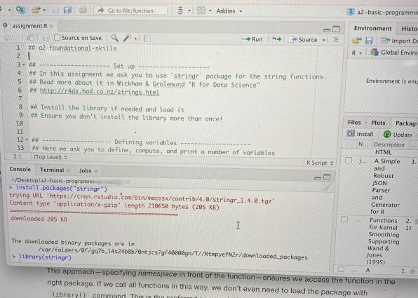

# How To Be A Developer

Here we discuss a few topics everyone who is developing code should
know.


## How To Solve Coding Problems

Everyone who writes code runs into problems.  Quite often you just
don't know how certain functions or libraries work, other time you may
not know if what you came up with is an efficient way to solve the
problem.  Sometimes you have coded all well but the results come out
just wrong.  Problems happen to all of us and as a point of departure,
expect to have one error per line of code (most of them easy to fix though).
How should you solve the problems?

We discuss here three approaches, and often you need a combination of
all of these:

* Read documentation and search the web.  Many R packages are well
  documented (but many
  are not).  This approach is often known as
  ["RTFM"](https://en.wikipedia.org/wiki/RTFM) or
  ["STFW"](https://en.wiktionary.org/wiki/STFW).
* Debugging.  This is a generic term to find and correct errors in
  your code and there are many approaches to debugging.  See more in
  [Debugging](#developer-debugging). 
* Ask for help.  An experienced person may be able solve to solve your
  question in seconds so do not hesitate to ask for help.  However,
  you should follow some rules when doing that.  See more in [How To
  Ask Questions](#developer-howto-questions).


### Read docs

TBD


### Debugging {#developer-debugging}

Debugging is a generic term that describes finding and correcting
errors in code.  The term originates from early days of computers
where errors were often coused by insects (bugs) crawling into the
machinery and interfering with its operations.  The insects are not a
problem any more but errors in code are as common as ever.
Programmers _do_ mistakes.  Newbies do mistakes.  Experienced
programmers do mistakes.  Everyone does and you will do too.  We have
to live with coding errors and to we have to learn to fix those.

There are various kinds of coding errors.
One of the first types of mistakes you do lead to **syntax errors**.
These mean that computer does not know what to do with the code, just
stops and outputs an error message.  For instance, when you try to add
a number and string, you get
```{r, error=TRUE}
1 + "2"
```
Syntax errors are typically easy to fix, but for beginners the
messages may look too cryptic and incomprehensible.  The message is
not very helpful if you don't know that "2" (quoted two) is a string
and hence not a number, and you have no idea what is "binary
operator".  To put it in a simpler language, `+` is a binary operator
because it expects to numbers to be
added.  And here it complaints that one of these was not a number but
a character string.

The good news with syntax errors is that you will learn to understand
these rather quickly.  These are also easy for experienced programmers
to clarify if you show the line of your code and the message.

It is often harder to spot **errors in program logic**--after all, you
code works!  But even if it works, the output may not be what you
want.  Or in a more tricky case you don't even know what the output
should look like.  Say, you want to compute the rural-urban migration
rate based on population registry data.  You find it is 1000 persons
per year.  Is this number correct?  We don't know unless we thoroughly
test the methods and data.

Below we describe a few common debugging techniques, some of those are
universal and some R-specific.  We focus on spotting and isolating
errors in logic but some of the methods are also suitable for syntax
errors. 


#### Understand your code

Before you even begin to debug, you should understand the code.  You
should understand every variable, every function, every logical
operation in the relevant code block.  You cannot isolate errors if
you don't know what exactly is that `if` statement doing there,
or what is the variable's value is supposed to be.

This is less of a problem when you are debugging your own code but may
be quite laborious if it has been written by someone else.  But even
in the latter case the issue
can often be isolated to a small part of code (for instance, to a
function), and in that case you do not have to learn the rest of the
code.


#### Print the values

This is perhaps one of the most powerful and universal method of
debugging.  You just insert printing commands into your code that
output the variables and data as the program runs.  If you examine
their values you should see where they deviate from what they ought to
be.  Needless to say, in order to see where the values get wrong you
need to know what the correct values ought to be!

Although nowadays there exist powerful debuggers that can stop your
code at pre-determined points or at pre-determined variable values,
the printing-values method is still alive and well.  It is simple (you
don't have to learn debuggers), it is universal as every programming
language can print, and it can be extended into environments where you
cannot easily use more powerful debuggers.  For instance, if are
developing a web backend and your code has to run
in a docker container on a restricted-access server, then it may be
very laborious to replicate the (restricted) working environment
on your own pc.  It may be much easier just to print the variable
values in the suspicious part of code (you may have to send output to
a log file though).

Let's demonstrate this with an example.  Suppose you are writing a
function that uses _iris_ data, and returns the average sepal length
for a species submitted in the argument.  The iris data, collected in
1930-s contains four flower measures of 150 iris flowers of three
different species.  An sample of the data looks like
```{r}
iris %>%
   sample_n(5)
```
The function might look like
```{r}
sepalLength <- function(species) {
   subset <- iris[iris$species == species]
   mean(subset$Sepal.Length)
}
```
And we may run the code as
```{r}
sepalLength("versicolor")
```
Obviously, the function does not work as expected.  But what went
wrong?  We can start debugging from beginning (probably correct
values) to end to spot where it goes wrong, or alternatively we begin
debugging from the
end (where we know the results are wrong) toward beginning to spot
where they are still correct.  Let's take the second approach and
print sepal length of the subset _inside of the function_.  So the
amended function will look like:
```{r}
sepalLength <- function(species) {
   subset <- iris[iris$species == species]
   cat("Sepal length:", subset$Sepal.Length, "\n")
   mean(subset$Sepal.Length)
}
```
and we call the function again:
```{r}
sepalLength("versicolor")
```
The line that was supposed to print sepal length printed nothing.
Hence our sepal length is empty for some reason (technically, it is
the special empty value `NULL`, you can see this if you use `print`
instead of `cat`).  But why is sepal length empty?  Let's print the
subset instead:
```{r}
sepalLength <- function(species) {
   subset <- iris[iris$species == species]
   cat(" -- subset:\n")
   print(subset)
   mean(subset$Sepal.Length)
}
sepalLength("versicolor")
```
We add both `cat(" --..` statement to indicate where the output should
be, and use `print` to print the actual data frame.  And the problem
is there we have a "data frame with 0 columns ...".  So the data frame
itself is empty.  But why is it empty?  Does the selection filter
`iris$species == species` work?  Let's try this:
```{r}
sepalLength <- function(species) {
   subset <- iris[iris$species == species]
   cat(" -- filter:\n")
   print(iris$species == species)
   mean(subset$Sepal.Length)
}
sepalLength("versicolor")
```
But why is the filter `logical(0)`, i.e. there are no values there?
Let's check the `iris$species`:
```{r}
sepalLength <- function(species) {
   subset <- iris[iris$species == species]
   cat(" -- species:\n")
   print(iris$species)
   mean(subset$Sepal.Length)
}
sepalLength("versicolor")
```
Woww!  `iris$species` comes back `NULL`.  Does iris data contain
species in the first place?
```{r}
names(iris)
```
And here we got it--the variable name is capitalized `Species`, not
lower-case `species`!

This example code was very simple and even little experienced
programmers might easily spot the problem without much effort.  But
the same approach applies to much more complex coding problems.


<div class="tbd">
* Rubber duck
* `browser()`
* unit tests
* do research:
    * search for error message
	* some advice may be dangerous
* mockup, simple test
</div>


### How To Ask Good Questions {#developer-howto-questions}

You can always as a question but as it turns out the same question
asked in one way is much easier to be answered than when asked
differently.  This is often a big stumbling block for beginners who do
not possess the vocabulary and the fine touch with style that make the
professionals willing to reply to the questions.  And these are often
experienced coders who answer your question in their free time!

There are many sources about asking good questions (see,
e.g. Stackoverflow [How to ask good
questions](https://stackoverflow.com/help/how-to-ask)).  These usually
boil down to 

1. Explain what do you do
2. Explain what goes wrong
3. Be polite

However, as each medium and context is somewhat specific, many of the
requirements that are true on one website may not be relevant for
another.  For instance, Stackoverflow insists that one should not ask
the same question again, but when doing coursework, it may be hard to
search the not-that-easily-searchable media for similar questions.


#### Explain what do you do

The first rule for someone to help you is that the person must
understand your goal.  You should be specific enough so that experts
are not confused.  For instance "I want to print numbers with a few
decimal digits only" is a good explanation.  "How to print correctly"
is too vague goal.

Unfortunately it is not always easy for beginners to describe the
problem in a language experts understand.  This includes concepts that
beginners are not quite sure about and use in a misleading way.  For
instance, if my function returns a wrong value, I may ask about "wrong
output".  But _output_ normally means what is printed on screen, and
this is not the same thing as what function returns (although return
value is sometimes printed).  This may throw off some experts and
cause some less-than-polite remarks in certain circumstances.  If you
are asking help in a professional forum such as Stackoverflow, it may
be a good idea to introduce yourself as beginner (e.g. "This is the
first time I use functions ... "), but it is obviously not necessary
when asking help from your course instructor.  You take the course
_because_ you are beginner!

The third, and extremely important point is to **show what you have
done**.  If your function's return value is wrong then usually _the
only way to help is to look at your code_.  So please show your code!
Either copy-paste the code to chat, or show a screenshot, or maybe you
want to upload it to a website or share a github link.  But be aware
that some ways of sharing your code expect more from the expert, and
they tend to be busy and not interested in spending extra time
downloading and setting up your code.  So the best way is to **show
your code right in the chat** or forum.  Second, simplify your code as
much as you can.  It is OK to post a 3-line function that misbehaves,
but it is not OK to post 300 lines that do a lot of tasks, most of
which are not at all related to your problem.  In that case make copy
of your code and delete everything that is not central to the
problem.  This is called **minimal reproducible example**.

<div class="clearfix">
<figure>

<figcaption>
A screenshot may be a good way to explain your question, here "_did I
install stringr correct or was I suppose to type the code in the upper
left then source it?_"  The image provides clear enough context (How did
you install it?  What is "upper left"?  What do you mean with
"source"?) and makes the question easy to answer.
</figcaption>
</figure>
Minimal example may contain something that is outside of the code.
Maybe you forgot to add a file to your git repo?  Maybe the file you
intend to use is in a different location?  Maybe you are running your
code in a wrong way?  In that case a screenshot accompanied with
description what do you do may be the best explanation.  For instance,
if R cannot find a file that you think is there, consider posting an
image that shows both R code (the part that attempts to load the
file), and a terminal window that shows content of the relevant
directory.  (You may also post the file explorer or finder window, but
those may obscure part of the file name, in particular the
extension).  If you run selected lines in RStudio, you may show a
screenshot with the selection highlighted, and tell "I select these
lines and click _Run_...".
</div>

So the **rules here** are

1. Explain what do you do
2. Be specific
3. Use precise language
4. Show your code (and other relevant context)
5. Show _only the relevant part_ of the code


#### Explain what goes wrong

First you should tell **what actually happens**.  Others may sometimes be able
to take your code, run it, and see the same output, but even if it is
the case, it requires much more effort from their side.  And
remember--experts (and instructors) are usually busy!  So it is your
task to show what actually happens.
Does your code
produce an error message?  Show it in its entirety!  Do not just say
"I get an error".  _Show the actual error message_!  This is a very
important clue that may help to find the problem much faster.

But often the problem is not the error message.  Your code runs but
produces wrong output.
It may be obvious for you but someone else looking at your code may
not understand what you are not happy with.  What is wrong if your
code computes `sqrt(2)` and outputs _1.4142135623730951455_?  It _is
correct_ after all.  You have to tell **what do you want to achieve**, e.g. you may
want to see just _1.414_ instead of the long list of digits.

Finally, tell us what did you try.  It is OK to ask for help but do
your own part first.  Did you google for the error message but nothing
useful showed up?  Did you read the docs but those were
incomprehensible (which is unfortunately too often the case)?  Did you
check if the files you need are where they are supposed to be?  Did
you try another way to achieve the task but you could not think of
any?  Try-first-yourself rule is here for two main reasons: you should
not ask the others to solve problems you can do easily yourself; and
second you should show the experts that your task is important enough
that at least _you_ have spend some effort trying to solve it.  It is
not fair that you just ask for help and only the others put in effort.

So the **rules here** are:

1. Show what happens
2. Explain what do you want to happen
3. Tell what did you try


## Coding Style

### Variable Names

TBD

* use appropriate names
* they should describe/distinguish 


### Comments

TBD
