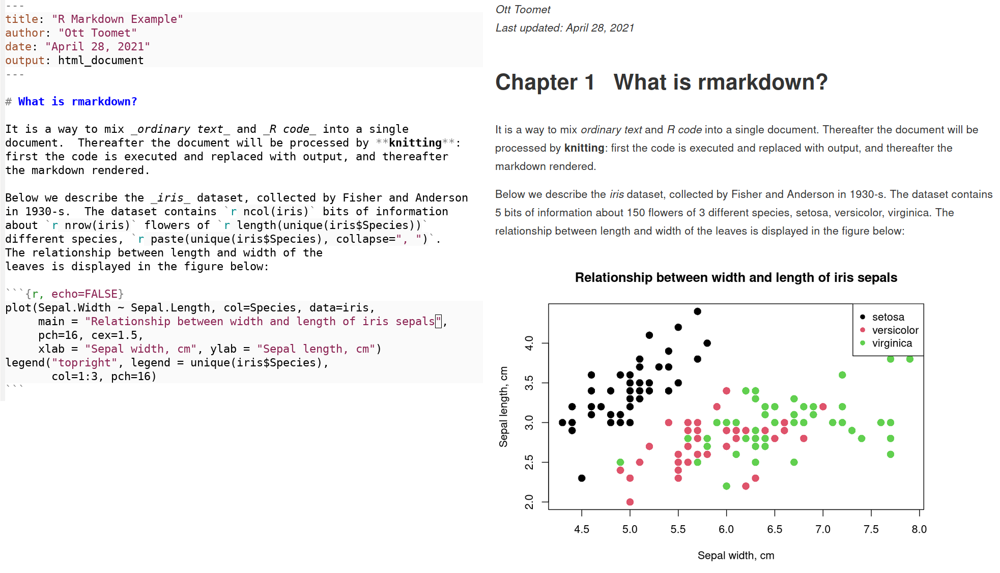

# R Markdown {#r-markdown}

## What is rmarkdown?

So far we have learned both markdown and R programming.  Both of these
methods have their strong and weak sides.  Markdown is good for
creating simple webpages with some design features like titles, images
and block quotes.  R however does nothing like that.  R can just
compute and create plots.  But what if we want to do both?
This is where rmarkdown comes to play.  The idea of rmarkdown is to
mix markdown (this is good for writing) and R (good for computing).
So as a result we can write text that contains all the bells and
whistles markdown offers, but also mix it with R code, and more
importantly, results of this code.  The figure below shows and example
rmarkdown document being written (left), and the resulting html in
browser (right).  Note how R code has been replaced by the
corresponding output, in particular the plot.  One can also see the
familiar elements from rendered markdown, for instance bold and italic text.

<figure class="wide">



<p class="caption">
Rmarkdown at work.  The left side shows an rmarkdown text being edited
with a text editor.  Note how the fixed-width fonts,
equal line spacing, and also syntax coloring (e.g. string constants
are marked red).  The right side shows the same document knitted and
rendered in a browser: the R code has been replaced by its output, in case of the
text paragraph these are the numbers and a list of iris species, in
case of the plotting code chunk it is the figure.
</p>
</figure>

But before we go any further--why might you _want_ to mix writing and
code?  There are two main intertwined reasons.

* You are interested in the _results_ and you want to write text about
  the results.  While you can always add comments to your code, the
  comments are normally about _the code_, not about _the results_.
  And for a good reason: code is code, the results are not visible!
* Second, you may want to re-do the results.  If you write only once,
  it is not hard to copy-paste the results (e.g. from the R output) to
  your document.  However, if you repeat your computations for some
  reason, you have to repeat all the copy-paste again.  This is
  tedious and error prone, imagine a document that contains hundreds
  of numbers and figures computed from data!

Rmarkdown offers solution to both of these problems.  You can write
text about your results and both will be in the final rendered
version.  And when you re-process it, it will automatically 
redo all the results with no manual work needed.
As an additional bonus, you also have now your code in the same
document (although not necessarily in the rendered version), so one
can go and check _how exactly_ did you compute the figures.

Technically, rmarkdown is a markdown document that contains normal
markdown text mixed with _code chunks_, chunks of R code that will can
be run by R like any other code.  Processing rmarkdown takes two
steps.  The first one is _knitting_, i.e. running the R code and inserting its
output into the document, this results in a plain markdown document.
Knitting is done by R using _knitr_ package.
Thereafter one has to render the markdown in a similar way as ordinary
markdown.  The final result can be _html_ or _pdf_ document, different
types of
slides, or even MSWord file.  This is again done by R using
_rmarkdown_ package and _pandoc_ app.


## R Markdown and RStudio

The most convenient way to create and process rmarkdown files is by
using RStudio.  It includes all the necessary packages and software,
and provides easy shortcuts to convert the whole document into
the final document.


### Creating Rmarkdown Files

<div class="clearfix">
<figure>

<figcaption>
Using the RStudio menu to create a new R Markdown document
</figcaption>
</figure>
The easiest way to start a new R-Markdown document in RStudio is to use the **File > New File > R Markdown** menu option:
</div>

</div class="clearfix">
<figure>

<figcaption>
RStudio's rmarkdown document type dialog
</figcaption>
</figure>
RStudio will then prompt you to provide some additional details about
what kind of R Markdown document you want. In particular, you will
need to choose a default _document type_ and _output format_. You can
also provide a title and author information which will be included in
the document (no worries if you don't know how to call your document--
you can easily change it later).
This chapter will focus on creating HTML documents
(websites; the default format)&mdash;other formats may require additional software.
</div>

Once you've chosen your desired document type and output format,
RStudio will open up a new document file for you.  The file contains
some example code (a template) to remind you the basic rmarkdown
syntax.  Rmarkdown files typically have extension `.Rmd`


### Rmarkdown Structure

Rmarkdown files normally begin with _header_ information like

```yaml
---
title: "My Night at Three Pints Inn"
author: "Ji Gong"
date: "April 28, 2021"
output: html_document
---
```
This tells R Markdown details about the file and how the file should be processed. For example, the `title`, `author`, and `date` will automatically be added to the top of your document. You can include additional information as well, such as [whether there should be a table of contents](http://rmarkdown.rstudio.com/html_document_format.html) or even [variable defaults](http://rmarkdown.rstudio.com/developer_parameterized_reports.html).

- The header is written in [YAML](https://en.wikipedia.org/wiki/YAML) format, which is yet another way of formatting structured data similar to `.csv` or JSON (in fact, YAML is a superset of JSON and can represent the same data structure, just using indentation and dashes instead of braces and commas).

Below the header, you will find two types of content:

- **Markdown**: normal Markdown text like you learned in [Chapter 3](#markdown). For example, you can use two pound symbols (`##`) for a second-level heading.
- **Code Chunks**: These are segments (chunks) of R code that look
  like normal code block elements (using <code>\`\`\`</code>), but
  with an extra `{r}` immediately after the opening backticks.  The
  `{r}` is a crucial marker and tells RStudio that code in these
  blocks must be executed, not just displayed.
  
- **Inline code chunks**: it is also possible to write short code
  snippets that output a single word or number _on the same line_ as
  text.  For instance, you may write text like 
  `"we have `<code>&grave;r nrow(data)&grave;</code>` observations..."`.
  This results in a line _"we
  have 150 observations..."_ (or whatever many observations does your
  data contain).

RStudio provides a convenient keyboard shortcut, `Ctrl-Alt-i`, for
creating new code chunks.


### Knitting Documents
RStudio provides an easy interface to compile your `.Rmd` source code into an actual document (a process called **"knitting"**). Simply click the **Knit** button at the top of the script panel:


This will generate the document (in the same directory as your `.Rmd` file), as well as open up a preview window in RStudio.

While it is easy to generate such documents, the knitting process can make it hard to debug errors in your `R` code (whether syntax or logical), in part because the output may or may not show up in the document! We suggest that you write complex `R` code in another script and then `source()` that script into your `.Rmd` file for use the the output. This makes it possible to test your data processing work outside of the knit application, as well as _separates the concerns_ of the data and its representation&mdash;which is good programming practice.

Nevertheless, you should still be sure and knit your document frequently, paying close attention to any errors that appear in the console.

<p class="alert alert-info">_Pro-tip_: If you're having trouble finding your error, a good strategy is to systematically remove segments of your code and attempt to re-knit the document. This will help you identify the problematic syntax.</p>


### HTML
Assuming that you've chosen HTML as your desired output type, RStudio will knit your `.Rmd` into a `.html` file. HTML stands for _**H**yper**T**ext **M**arkup **L**anguage_ and, like Markdown, is a syntax for describing the structure and formatting of content (though HTML is **far** more extensive and detailed). In particular, HTML is a markup language that can be automatically rendered by web browsers, and thus is the language used to create web pages. As such, the `.html` files you create can be put online as web pages for others to view&mdash;you will learn how to do this in a future chapter. For now, you can open a `.html` file in any browser (such as by double-clicking on the file) to see the content outside of RStudio!

- As it turns out, it's quite simple to use GitHub to host publicly available webpages (like the `.html` files you create with RMarkdown). But, this will require learning a bit more about `git` and GitHub. For instructions on publishing your `.html` files as web-pages, see [chapter 14](#git-branches).

## R Markdown Syntax
What makes R Markdown distinct from simple Markdown code is the ability to actually _execute your `R` code and include the output directly in the document_. `R` code can be executed and included in the document in blocks of code, or even inline in the document!

### R Code Chunks
Code that is to be executed (rather than simply displayed as formatted text) is called a **code chunk**. To specify a code chunk, you need to include **`{r}`** immediately after the backticks that start the code block (the <code>\`\`\`</code>). For example:

```{r results='asis', echo=FALSE}
# written as string to help with formatting
cat("````rmd
Write normal **markdown** out here, then create a code block:

\`\`\`{r}
# Execute R code in here
x <- 201
\`\`\`

Back to writing _markdown_ out here.
````")
```

Note that by default, the code chunk will _render_ any raw expressions (e.g., `x`)&mdash;just like you would see in the console if you selected all the code in the chunk and used `ctrl-enter` to execute it.

It is also possible to specify additional configuration **options** by including a comma-separate list of named arguments (like you've done with lists and functions) inside the curly braces following the `r`:


```{r results='asis', echo=FALSE}
# written as string to help with formatting
cat("````rmd
\`\`\`{r options_example, echo=FALSE, message=TRUE}
# a code chunk named \"options_example\", with parameter `echo` assigned FALSE
# and parameter `message` assigned TRUE

# Would execute R code in here
\`\`\`
````")
```

- The first "argument" (`options_example`) is a "name" for the chunk, and the following are named arguments for the options. Chunks should be named as a variable or function, based on what code is being executed and/or rendered by the chunk. It's always a good idea to name individual code chunks as a form of documentation.

There are [many options](https://yihui.name/knitr/options/) for creating code chunks (see also the [reference](https://www.rstudio.com/wp-content/uploads/2015/03/rmarkdown-reference.pdf)). However some of the most useful ones have to do with how the code is outputted in the the document. These include:

- **`echo`** indicates whether you want the _R code itself_ to be displayed in the document (e.g., if you want readers to be able to see your work and reproduce your calculations and analysis). Value is either `TRUE` (do display; the default) or `FALSE` (do not display).
- **`message`** indicates whether you want any messages generated by the code to be displayed. This includes print statements! Value is either `TRUE` (do display; the default) or `FALSE` (do not display).

If you only want to _show_ your `R` code (and not _evaluate_ it), you can alternatively use a standard Markdown codeblock that indicates the `r` language (<code>\`\`\`r</code>, _not_ <code>\`\`\`{r}</code>), or set the `eval` option to `FALSE`.


### Inline Code
In addition to creating distinct code blocks, you may want to execute R code _inline_ with the rest of your text. This empowers you to **reference a variable** from your code-chunk in a section of Markdown&mdash;injected that variable into the text you have written. This allows you to easily include a specific result inside a paragraph of text. So if the computation changes, re-knitting your document will update the values inside the text without any further work needed.

As with code blocks, you'll follow the Markdown convention of using single backticks (**`` ` ``**), but put the letter **`r`** immediately after the first backtick. For example:

<!-- RMarkdown doesn't provide built-in escaping. See https://stackoverflow.com/q/20409172 for
     details on the workaround. -->
```markdown
To calculate 3 + 4 inside some text, we can use `r '\x60r 3 + 4\x60'` right in the _middle_.
```

When you knit the text above, the <code>&#96;r 3 + 4&#96;</code> would be replaced with the number `7`.

<p class="alert alert-info">Note you can also reference values computed in the code blocks preceding your inline code; it is **best practice** to do your calculations in a code block (with `echo=FALSE`), save the result in a variable, and then simply inline that variable with e.g., <code>&#96;r my.variable&#96;</code>.</p>


## Rendering Data
R Markdown's code chunks let you perform data analysis directly in your document, but often you will want to include more complex data output. This section discusses a few tips for specifying dynamic, complex output to render using R Markdown.

### Rendering Strings
If you experiment with knitting R Markdown, you will quickly notice that using `print()` will generate a code block with content that looks like a printed vector:

```{r results='asis', echo=FALSE}
# written as string to help with formatting
cat("````rmd
\`\`\`{r echo=FALSE}
print(\"Hello world\")
\`\`\`
````")
```

```{r echo=FALSE}
print("Hello world")
```

For this reason, you usually want to have the code block generate a string that you save in a variable, which you can then display with an inline expression (e.g., on its own line):


```{r results='asis', echo=FALSE}
# written as string to help with formatting
cat("````rmd
\`\`\`{r echo=FALSE}
msg <- \"Hello world\"
\`\`\`

Below is the message to see:
\`r msg`
````")
```

Note that any Markdown syntax included in the variable (e.g., if you had `msg <- "**Hello** world"`) will be rendered as well&mdash;the <code>&#96;r msg &#96;</code>is replaced by the value of the expression just as if you had typed that Markdown in directly. This allows you to even include dynamic styling if you construct a "Markdown string" out of your data.

Alternatively, you can use as [`results`](https://yihui.name/knitr/options/#text-results) option of `'asis'`, which will cause the "output" to be rendered directly into the markdown. When combined with the [`cat()`](https://www.rdocumentation.org/packages/base/versions/3.4.3/topics/cat) function (which con**cat**enates content without specifying additional information like vector position), you can make a code chunk effectively render a specific string:

```{r results='asis', echo=FALSE}
# written as string to help with formatting
cat("````rmd
\`\`\`{r results='asis', echo=FALSE}
cat(\"Hello world\")
\`\`\`
````")
```

### Rendering Lists
Because outputted strings render any Markdown they contain, it's possible to specify complex Markdown such as _lists_ by constructing these strings to contain the `-` symbols utilized (note that each item will need to be separated by a line break or a `\n` character):

```{r results='asis', echo=FALSE}
# written as string to help with formatting
cat("````rmd
\`\`\`{r echo=FALSE}
markdown.list <- \"
- Lions
- Tigers
- Bears
\"
\`\`\`

\`r markdown.list`
````")
```

Would output a list that looks like:

<div class="list-condensed">
- Lions
- Tigers
- Bears
</div>

Combined with the vectorized `paste()` function, it's to easily convert vectors into Markdown lists that can be rendered

```{r results='asis', echo=FALSE}
# written as string to help with formatting
cat("````rmd
\`\`\`{r echo=FALSE}
animals <- c(\"Lions\", \"Tigers\", \"Bears\")

# paste a `-` in front of each, then cat the items with newlines between
markdown.list <- paste(paste('-',animals), collapse='\\n')
\`\`\`

\`r markdown.list`
````")
```

And of course, the contents of the vector (e.g., the text `"Lions"`) could easily have additional Markdown syntax syntax to include bold, italic, or hyperlinked text.

- Creating a "helper function" to do this conversion is perfectly reasonable; or see libraries such as [`pander`](http://rapporter.github.io/pander/) which defines a number of such functions.


### Rendering Tables
Because data frames are so central to programming with R, R Markdown includes capabilities to easily render data frames as Markdown _tables_ via the [**`knitr::kable()`**](https://www.rdocumentation.org/packages/knitr/versions/1.19/topics/kable) function. This function takes as an argument the data frame you wish to render, and it will automatically convert that value into a Markdown table:

```{r results='asis', echo=FALSE}
# written as string to help with formatting
cat('````rmd
\`\`\`{r echo=FALSE}
library(knitr)  # make sure you load this library (once per doc)

# make a data frame
letters <- c("a", "b", "c")
numbers <- 1:3
df <- data.frame(letters = letters, numbers = numbers)

# render the table
kable(df)
\`\`\`
````')
```

- `kable()` supports a number of other arguments that can be used to customize how it outputs a table.
- And of courrse, if the values in the dataframe are strings that contain Markdown syntax (e.g., bold, itaic, or hyperlinks), they will be rendered as such in the table!

So while you may need to do a little bit of work to manually generate the Markdown syntax, it is possible to dynamically produce complex documents based on dynamic data sources


## R Notebooks

<p class="tbd">
Write about notebooks
</p>


## Resources {-}
- [R Markdown Homepage](http://rmarkdown.rstudio.com/)
- [R Markdown Cheatsheet](https://www.rstudio.com/wp-content/uploads/2016/03/rmarkdown-cheatsheet-2.0.pdf) (really useful!)
- [R Markdown Reference](https://www.rstudio.com/wp-content/uploads/2015/03/rmarkdown-reference.pdf) (really useful!)
- [`knitr`](https://yihui.name/knitr/)
