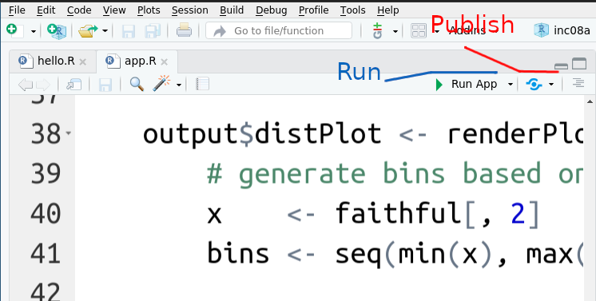
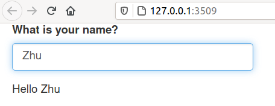
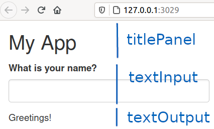

# The `shiny` Framework {#shiny}

Instead of providing users static images or tables, it is often useful
to set up an interactive environment where users can experiment with
the data themselves and receive immediate feedback.
Nowadays it is fairly easy thanks to powerful browsers and javascript
libraries.

In this chapter, we describe the **Shiny** framework for building
interactive applications in R. Shiny provides a structure for
communicating between a user-interface (i.e., a web-browser) and an R
session, allowing users to interactively change the "code" that is run
and the data that are output. This not only enables developers to
create **interactive graphics**, but provides a way for users to
interact directly with an R session.

_Shiny_ is one of the most popular ways to create interactive apps
using R, largely thanks to its simplicity.  It also has free online
repository, [shinyapps.io](shinyapps.io) where one can host their
apps.

Technically, a running _shiny_ application consists of a web server
that creates the webpage you can see in browser.  The web server is
started automatically when you run your app.  The server reads your
code and builds the corresponding webpages.  It can also run your code
(and normally it does) for, e.g. creating plots and analyzing data.
Besides running your code, it listens for user inputs (e.g. clicking
on checkboxes or selecting menu items) and tells your code about what
the user did.


## Writing Shiny Applications

Shiny is a **web application framework for R**. As opposed to a simple
(static) web page like you've created with R Markdown, a _web
application_ is an interactive, dynamic web page&mdash;the user can
click on buttons, check boxes, or input text in order to change the
presentation of the data, or otherwise the feel and look of the
webpage.  Shiny is a _framework_ in that it automatically create the
code for producing and enabling this interaction, while you as the
developer simply "fill in the blanks" by providing _variables_ or
_functions_ that the shiny library will utilize to create the interactive page.

The shiny framework can be enabled by loading the _shiny_ package,
so you will need to install and load it in order to use it:

```r
## install.packages("shiny")  # once per machine
library("shiny")
```

This will make all of the framework functions and variables you will need to work with available.

Fortunately, shiny does most of the hard work related to setting up a
web server and providing communication between your code and the user
interactions.  You only have to write your data analysis code, and
define the server-side and the user-interface (UI) side of the app.


### Creating Shiny Apps in RStudio {#creating-shiny-apps-rstudio}

Rstudio offers good templates for getting started with shiny apps.
The main menu offer option _File_ / _New File_ / _Shiny Web App_.
This opens a small dialog window asking for the name of the app, and
whether it is a single- or a multi-file app (more about the latter
below).
If you choose the single-file option, RStudio creates a folder with
the given app name, and calls the code inside _app.R_.  If you choose
the multi-file option, it creates two files inside the folder, one
called _ui.R_ and the other called _server.R_.

Very conveniently for beginners, it also fills the files with a
functioning app (that explores Old Faithful geyser eruptions) so you
have a fully-functional template to start modifying for your own
needs. 

<div class="clearfix">
<figure>

<caption>
The "Run App" and "Publish" buttons in RStudio code window.
</caption>
</figure>
Finally, when editing shiny apps, RStudio code window will include
buttons _Run App_ and _publish_.  The former just runs to app in your
computer, the other can be used to publish it at _shinyapps.io_.
</div>


### UI and Server

1. The **User Interface (UI)** defines how the application will be
   _displayed_ in the browser. The UI can render R content such as
   text or graphics just like R Markdown, but it can also include
   **widgets**, which are interactive controls for your application
   (such as buttons, sliders and menus).  The UI can specify a **layout** for these components (e.g., so you can put widgets above, below, or beside one another).

    The UI for a Shiny application is defined as a **value**, usually one returned from calling a **layout function**. For example:

    ```r
    ## The ui is the result of calling the `fluidPage()` layout function
    ui <- fluidPage(
       ## A widget: a text input box (save input in the `username` key)
       textInput("username", label = "What is your name?"),
       ## An output element: a text output (for the `message` key)
       textOutput("message")
    )
    ```

    This UI defines a [fluidPage](https://shiny.rstudio.com/reference/shiny/latest/fluidPage.html) (where the content flows "fluidly" down the page), that contains two _content elements_: a text input box where the user can type their name, and some outputted text based on the `message` variable.

2. The **Server** defines the data that will be displayed through the
   UI. You can think of this as an interactive R script that the user
   will be able to "run": the script will take in _inputs_ from the
   user (based on their interactions) and provide _outputs_ that the
   UI will then display.   In this example, it takes a text input
   (_username_) and combines and dispalys "Hello \<username\>".  
   The server uses **reactive expressions**, which are like functions that will automatically be re-run whenever the input changes. This allows the output to be dynamic and interactive.

    The Server for a Shiny application is defined as a **function** (as opposed to the UI which is a _value_). This function takes in two _lists_ as argments: an `input` and `output`. It then uses _render functions_ and _reactive expressions_ that assign values to the `output` list based on the `input` list. For example:

    ```r
    ## The server is a function that takes `input` and `output` args
    server <- function(input, output) {
       ## assign a value to the `message` key in `output`
       ## argument is a reactive expression for showing text
       output$message <- renderText({
          ## use the `username` key from input and and return new value
          ## for the `message` key in output
          paste("Hello", input$username)
       })
    }
    ```

<div class="clearfix">
<figure>

<caption>
The "hello" app running in a web browser.  The text entry box lets you enter the name, and
below the computer uses the name in the displayed message.
</caption>
</figure>
Combined, this UI and server will allow the user to type their name
into an input box, and will then say "hello" to whatever name is typed
in.  Shiny sets up a communication channel between the UI and server,
so as soon as you start typing the name, the letters you have already typed appear in
the message.

Technically, for each letter you type, shiny calls the _server_
function with a list argument `input`.  The lists component `username`
contains the name that the user typed (or just the letters the user
has typed so far).  Now server uses the input to update the component
`message` in the output list by pasting "Hello" and the `username`.
Thereafter _UI_ takes the field `output$message` and renders it as
text below the input box.  Thereafter it waits for the next user input
and calls server again as soon as the user adds another character to
the name.
</div>


### Combining UI and Server

There are two ways of combining the UI and server:

The first (newer) way is to define a file called **`app.R`**.  This
file should define the server and UI as above, and afterwards call the [**`shinyApp()`**](http://shiny.rstudio.com/reference/shiny/latest/shinyApp.html) function, which takes a UI value and Server function as arguments. For example:

```r
## pass the 'ui' and 'server' defined above 
shinyApp(ui = ui, server = server)
```

Executing the `shinyApp()` function will start the App (you can also click the **"Run App"** button at the top of RStudio).

- Note: if you change the UI or the Server, you do not need to stop
  and start the app; you can simply refresh the browser or RStudio
  viewer window and it will reload the updated version.

- If you need to stop the App, you can hit the "Stop Sign" icon on the
  RStudio console, or just close the viewer.

Using this function allows you to define your entire application (UI
and Server) in a single file.  This approach is good for simple
applications that you wish to be able to share with others, since the
entire application code can be listed in a single file.

Alternatively, you can also define the UI and server as _separate_
files.  This allows you to keep the presentation (UI) separated from
the logic (server) of your application, making it easier to maintain
and develop it in the future.  To do this, you define two separate files: **`ui.R`** for the UI and **`server.R`** for the Server (the files **must** be named `ui.R` and `server.R`). In these files, you must call the functions `shinyUI()` and `shinyServer()` respectively to create the UI and server, and then RStudio will automatically combine these files together into an application:

```r
# In ui.R file
my_ui <- fluidPage(
  # define widgets
)

shinyUI(my_ui)
```

```r
# In server.R file
my_server <- function(input, output) {
  # define output reactive expressions
}

shinyServer(my_server)
```

Whichever way you choose, RStudio will create you a suitable template
as [explained above](#creating-shiny-apps-rstudio).

Finally, for larger projects you may have more than two code files.
In particular the server tasks tend to grow large as the data
processing may be complex.  In such case you may create several files
then use `source()` to load them into the `app.R` or `server.R` file.


This chapter will primarily use the "single file" approach for compactness and readability, but you are encouraged to break up the UI and server into separate files for your own, larger applications.


## The UI

The UI defines how the app will be displayed in the browser, and what
will be displayed on different locations on the page. 
You create a UI by calling a **layout function**, normmaly
`fluidPage()`, which returns a UI definition that can be used by the
`shinyUI()` or `shinyApp()` functions.  `fluidPage()` creates a
"fluid" page, a webpage that adjusts its content location when you
resize it, or change the zoom level or font size.  This is what we
normally want.


### UI Content Elements

`fluidPage()` takes arguments that specify the **content elements**
that should be displayed on the page:
```r
## a pseudocode example, calling 'fluidPage' with three elements
ui <- fluidPage(element1, element2, element3)
```
This will create a page of three elements, and put these elements
underneath each other.

Content elements are defined by calling specific functions that create
them:
```r
## ui is a value what fluidPage returns!
ui <- fluidPage(
   titlePanel("My App"),
   textInput('username', label = "What is your name?"),
   textOutput('message')
)
```
<div class="clearfix">
In the example above `titlePanel()` will create a page title,
`textInput()` will create an element where the user can enter text,
and `textOutput` will create an element that can have dynamic
(changing) text content.  See the figure for an illustration how the
page layout looks like.
<figure>

<caption>
The example page in browser.  The three layout elements are made
visible.
The content of the last, `textOutput` element, is created
by the server, and only displayed by the UI.
</caption>
</figure>
</div>

Content elements are often defined in a
nested fashion, e.g. we have one element `sidebarLayout`, that
contains two further elements `sidebarPanel` and `mainPanel`.  (More
precisely: `sidebarLayout` is not a content element but a function
that creates such an element.) 
Sidebar
layout is often used in simple apps where you have a narrow panels
with control widgets on the left-hand side and a large panel with the
main content (such as plot) on the right hand side.
Note that many layout functions take arguments that are other layout
elements and arrange those into their layout.  E.g. `sidebarLayout`
takes two layout elements as arguments, and arranges those in a way
that the first one is placed on the left side and given little space, the
other is placed on the right hand side and given more space.  In this
way it is possible to include a layout inside another layout. This allows you to create complex layouts by combining multiple layout elements together. For example:
```r
ui <- fluidPage(
   titlePanel("My Title"),  # include panel with the title (also sets browser title)
  
   sidebarLayout(   # underneath the title, use sidebar layout
      sidebarPanel(  # specify content for the narrow sidebar
         p("See plot at right") 
      ),
      mainPanel(     # specify content for the wide "main" panel
         plotOutput("plot") 
      )
   )
)
```

See the [Shiny documentation](http://shiny.rstudio.com/reference/shiny/latest/) and [gallery](http://shiny.rstudio.com/gallery/) for details and examples of doing complex application layouts.

<p class="alert alert-info">Fun Fact: much of Shiny's styling and layout structure is based on the [Bootstrap](http://getbootstrap.com/) web framework.</p>

You can include _static_ (unchanging) content in a Shiny UI layout&mdash;this is similar to the kinds of content you would write in Markdown (rather than inline R) when using R Markdown. However, you usually don't specify this content using Markdown syntax (though it is possible to [include a markdown file](http://shiny.rstudio.com/reference/shiny/latest/include.html)'s content). Instead, you include content functions that produce HTML, the language that Markdown is converted to when you look at it in the browser. These functions include:

- `p()` for creating paragraphs, the same as plain text in Markdown
- `h1()`, `h2()`, `h3()` etc for creating headings, the same as `# Heading 1`, `## Heading 2`, `### Heading 3` in Markdown
- `em()` for creating _emphasized_ (italic) text, the same as `_text_` in Markdown
- `strong()` for creating **strong** (bolded) text, the same as `**text**` in Markdown
- `a(text, href='url')` for creating hyperlinks (anchors), the same as `[text](url)` in Markdown
- `img(text, src='url')` for including images, the same as `` in Markdown

There are many other methods as well, see [this tutorial lesson](http://shiny.rstudio.com/tutorial/lesson2/) for a list. If you are [familiar with HTML](https://info343-au16.github.io/#/tutorials/html), then these methods will seem familiar; you can also write content in HTML directly using the `tag()` content function.

<!-- TODO: Add HTML tutorial! -->

### Control Widgets and Reactive Outputs
It is more common to include **control widgets** as content elements in your UI layout. Widgets are _dynamic_ (changing) control elements that the user can interact with. Each stores a **value** that the user has entered, whether by typing into a box, moving a slider, or checking a button. When the user changes their input, the stored _value_ automatically changes as well.


Like other content elements, widgets are created by calling an appropriate function. For example:

- `textInput()` creates a box in which the user can enter text
- `sliderInput()` creates a slider
- `selectInput()` creates a dropdown menu the user can choose from
- `checkboxInput()` creates a box the user can check (using `checkboxGroupInput()` to group them)
- `radioButtons()` creates "radio" buttons (which the user can select only one of at a time)

See [the documentation](http://shiny.rstudio.com/reference/shiny/latest/), and [this tutorial lesson](http://shiny.rstudio.com/tutorial/lesson3/) for a complete list.

All widget functions take at least two arguments:

- A **name** (as a string) for the widget's value. This will be the **"key"** that will allow the server to be able to access the value the user has input (think: the key in the `input` _list_).
- A **label** (a string or content element described above) that will be shown alongside the widget and tell the user what the value represents. Note that this can be an empty string (`""`) if you don't want to show anything.

Other arguments may be required by a particular widget&mdash;for example, a slider's `min` and `max` values:

```r
# this function would be nested in a layout function (e.g., `fluidPage()`)
sliderInput(
  "age", # key this value will be assigned to
  "Age of subjects", # label
  min = 18, # minimum slider value
  max = 80, # maximum slider value
  value = 42 # starting value
)
```

Widgets are used to provide **inputs _to_** the Server; see the below section for how to use these inputs, as well as examples from [the gallery](http://shiny.rstudio.com/gallery/).

In order to display **outputs _from_** the Server, you include a **reactive output** element in your UI layout. These are elements similar to the basic content elements, but instead of just displaying _static_ (unchanging) content they can display _dynamic_ (changing) content produced by the Server.

As with other content elements, reactive outputs are creating by calling an appropriate function. For example:

- `textOutput()` displays output as plain text (note this output can be nested in a content element for formatting)
- `tableOutput()` displays output as a data table (similar to `kable()` in R Markdown). See also `dataTableOutput()` for an interactive version!
- `plotOutput()` displays a graphical plot, such as one created with `ggplot2`

Each of these functions takes as an argument the **name** (as a string) of the value that will be displayed. This is the **"key"** that allows it to access the value the Server is outputting. Note that the functions may take additional arguments as well (e.g., to specify the size of a plot); see [the documentation](http://shiny.rstudio.com/reference/shiny/latest/) for details.


## The Server
The Server defines how the data input by the user will be used to create the output displayed by the app&mdash;that is, how the _control widgets_ and _reactive outputs_ will be connected. You create a Server by _defining a new function_ (not calling a provided one):

```r
server <- function(input, output) {
  # assign values to `output` here
}
```

Note that this is _just a normal function_ that happens two take **lists** as arguments. That means you can include the same kinds of code as you normally would&mdash;though that code will only be run once (when the application is first started) unless defined as part of a reactive expression.

The first argument is a list of any values defined by the _control widgets_: each **name** in a control widget will be a **key** in this list. For example, using the above `sliderInput()` example would cause the list to have an `age` key (referenced as `input$age`). This allows the Server to access any data that the user has input, using the key names defined in the UI. Note that the values in this list _will change as the user interacts with the UI's control widgets_.

The purpose of the Server function is to assign new _values_ to the `output` argument list (each with an appropriate _key_). These values will then be displayed by the _reactive outputs_ defined in the UI. To make it so that the values can actually be displayed by by the UI, the values assigned to this list need to be the results of **Render Functions**. Similar to creating widgets or reactive outputs, different functions are associated with different types of output the server should produce. For example:

- `renderText()` will produce text (character strings) that can be displayed (i.e., by `textOutput()` in the UI)
- `renderTable()` will produce a table that can be displayed (i.e., by `tableOutput()` in the UI)
- `renderPlot()` will produce a graphical plot that can be displayed (i.e., by `plotOutput()` in the UI)

Render functions take as an argument a **Reactive Expression**. This is a lot like a function: it is a **block** of code (in braces **`{}`**) that **returns** the value which should be rendered. For example:

```r
output$msg <- renderText({
  # code goes here, just like any other function
  my_greeting <- "Hello"

  # code should always draw upon a key from the `input` variable
  message <- paste(my_greeting, input$username)

  # return the variable that will be rendered
  return(message)
})
```

The only difference between writing a _reactive expression_ and a function is that you only include the _block_ (the braces and the code inside of them): you don't use the keyword `function` and don't specify a set of arguments.

<p class="alert alert-info">This technically defines a _closure_, which is a programming concept used to encapsulate functions and the context for those functions.</p>

These _reactive expressions_ will be "re-run" **every time** one of the `input` values that it references changes. So if the user interacts with the `username` control widget (and thereby changes the value of the `input` list), the expression in the above `renderText()` will be executed again, returning a new value that will be assigned to `output$msg`. And since `output$msg` has now changed, any _reactive output_ in the UI (e.g., a `textOutput()`) will update to show the latest value. This makes the app interactive!

### Multiple Views
It is quite common in a Shiny app to produce _lots_ of output variables, and thus to have multiple reactive expressions. For example:

```r
server <- function(input, output) {
  # render a histogram plot
  output$hist <- renderPlot({
    uniform_nums <- runif(input$num, 1, 10)  # random nums between 1 and 10
    return(hist(uniform_nums))  # built-in plotting for simplicity
  })

  # render the counts
  output$counts <- renderPrint({
    uniform_nums <- runif(input$num, 1, 10)  # random nums between 1 and 10
    counts <- factor(cut(uniform_nums, breaks=1:10))  # factor
    return(summary(counts))  # simple vector of counts
  })
}
```

If you look at the above example though, you'll notice that each render function produces a set of random numbers... which means each will produce a _different_ set of numbers! The histogram and the table won't match!

This is an example of where you want to share a single piece of data (a single **model**) between multiple different renditions (multiple **views**). Effectively, you want to define a shared variable (the `uniform_nums`) that can be referenced by both render functions. But since you need that shared variable to be able to _update_ whenever the `input` changes, you need to make it be a _reactive expression_ itself. You can do this by using the **`reactive()`** function:

```r
server <- function(input, output) {
  # define a reactive variable
  uniform_nums <- reactive({
    return(runif(input$num, 1, 10))  # just like for a render function
  })

  # render a histogram plot
  output$hist <- renderPlot({
    return(hist(uniform_nums()))  # call the reactive variable AS A FUNCTION
  })

  # render the counts
  output$counts <- renderPrint({
    counts <- factor(cut(uniform_nums(), breaks=1:10))  # call the reactive variable AS A FUNCTION
    return(summary(counts))
  })
}
```

The `reactive()` function lets you define a single "variable" that is a _reactive function_ which can be called from within the render functions. Importantly, the value returned by this function (the `uniform_nums()`) only changes **when a referenced `input` changes**. Thus as long as `input$num` stays the same, `uniform_nums()` will return the same value.

This is very powerful for allowing multiple **views** of a single piece of data: you can have a single source of data displayed both graphically and textually, with both views linked off of the same processed data table. Additionally, it can help keep your code more organized and readable, and avoid needing to duplicate any processing.


## Publishing Shiny Apps
Sharing a Shiny App with the world is a bit more involved than simply pushing the code to GitHub. You can't just use GitHub pages to host the code because, in addition to the HTML UI, you need an R interpreter session to run the Server that the UI can connect to (and GitHub does not provide R interpreters)!

While there are a few different ways of "hosting" Shiny Apps, in this course you'll use the simplest one: hosting through [**shinyapps.io**](https://www.shinyapps.io). shinyapps.io is a platform for hosting and running Shiny Apps; while large applications cost money, anyone can deploy a simple app (like the ones you'll create in this course) for free.

In order to host your app on shinyapps.io, you'll need to [create a free account](https://www.shinyapps.io/admin/#/signup). Note that you can sign up with GitHub or your Google/UW account. Follow the site's instructions to

1. Select an account name (use something professional, like you used when signing up with GitHub)
2. Install the required `rsconnect` package (may be included with RStudio)
3. Set your authorization token ("password"). Just click the green "Copy to Clipboard" button, and then paste that into the **Console** in RStudio. You should only need to do this once.

    <p class="alert alert-warning">Don't worry about "Step 3 - Deploy"; you'll do that through RStudio directly!</p>

After you've set up an account, you can _Run_ your application (as above) and hit the **Publish** button in the upper-right corner:


This will put your app online, available at

```
https://USERNAME.shinyapps.io/APPNAME/
```

**Important** Publishing to shinyapps.io is one of the major "pain points" in working with Shiny. For the best experience, be sure to:

1. Always test and debug your app _locally_ (e.g., on your own computer, by running the App through RStudio). Make sure it works on your machine before you try to put it online.

2. Use correct folder structures and _relative paths_. All of your app should be in a single folder (usually named after the project). Make sure any `.csv` or `.R` files referenced are inside the app folder, and that you use relative paths to refer to them. Do not include any `setwd()` statements in your code; you should only set the working directory through RStudio (because shinyapps.io will have its own working directory).

3. It is possible to [see the logs for your deployed app](http://docs.rstudio.com/shinyapps.io/applications.html#logging), which may include errors explaining any problems that arise when you deploy your app.

For more options and details, see [the shinyapps.io documentation](http://docs.rstudio.com/shinyapps.io/index.html).

## Resources {-}
- [Shiny Documentation](http://shiny.rstudio.com/articles/)
- [Shiny Basics Article](http://shiny.rstudio.com/articles/basics.html)
- [Shiny Tutorial](http://shiny.rstudio.com/tutorial/) (video; links to text at bottom)
- [Shiny Cheatsheet](https://www.rstudio.com/wp-content/uploads/2016/01/shiny-cheatsheet.pdf)
- [Shiny Example Gallery](http://shiny.rstudio.com/gallery/)
- [shinyapps.io User Guide](http://docs.rstudio.com/shinyapps.io/index.html)
- [Interactive Plots with Shiny](http://shiny.rstudio.com/articles/plot-interaction.html) (see also [here](https://blog.rstudio.org/2015/06/16/shiny-0-12-interactive-plots-with-ggplot2/))
- [Interactive Docs with Shiny](https://shiny.rstudio.com/articles/interactive-docs.html)
